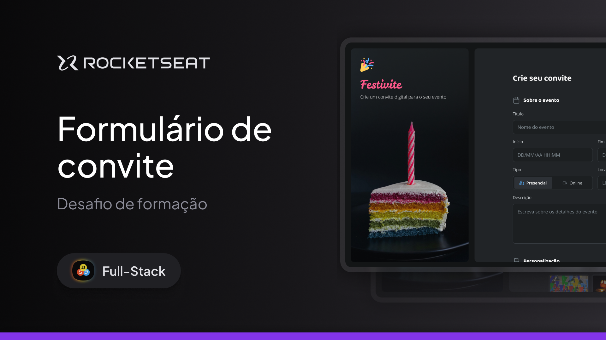

# Formulário de Convite

Projeto de um formulário de convite desenvolvido para treinar estrutura HTML, estilização com CSS e interações básicas com JavaScript.

## 📸 Pré-visualização

## 🛠 Tecnologias utilizadas
- HTML5
- CSS3
- JavaScript

## ⚙️ Funcionalidades
- Campos de preenchimento de dados
- Validação básica de formulário
- Layout responsivo

## ▶️ Como executar o projeto
1. Baixe ou clone este repositório
2. Abra o arquivo `index.html` no navegador

## 📚 Aprendizados
- Manipulação de inputs com JavaScript
- Organização de arquivos do projeto
- Boas práticas de estrutura HTML e CSS

## 🚀 Próximos passos
- Melhorar validações
- Adicionar envio de dados
- Melhorar acessibilidade
